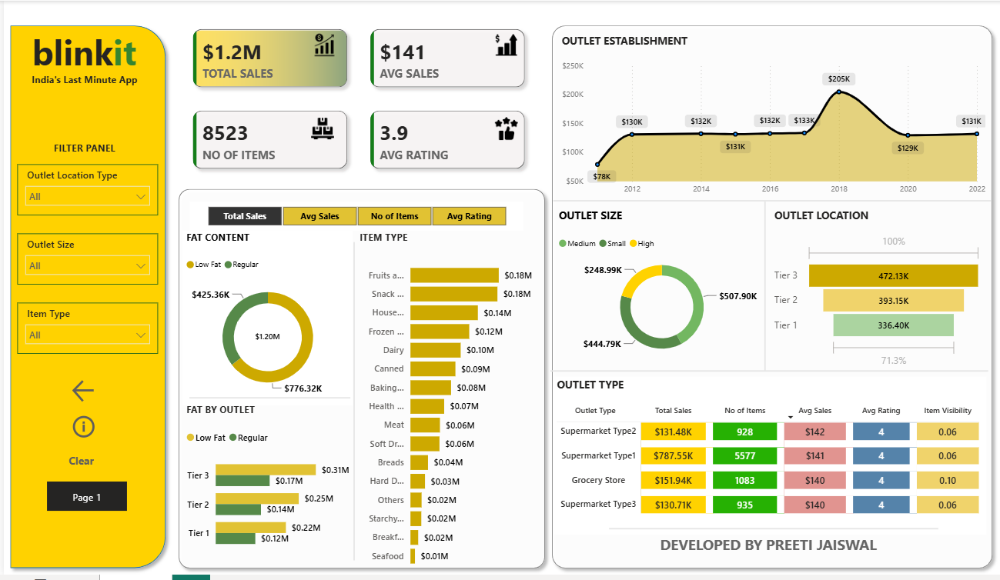

# Blinkit-Analysis-Dashboard-PowerBI
An interactive **Power BI dashboard** built to analyze Blinkit's sales performance, product categories, outlet characteristics, customer ratings, and regional trends.

## 📊 Project Overview

This project analyzes Blinkit sales data to identify key business patterns and performance drivers across different **outlet types, outlet sizes, locations, product categories, fat content, and establishment years**.

The dashboard transforms raw sales data into interactive visualizations and KPIs that make it easier to understand business performance and derive actionable insights.

## 🎯 Business Objectives

* Analyze overall sales performance and key KPIs
* Compare sales across different outlet types and sizes
* Identify top-performing product categories
* Analyze sales across Tier 1, Tier 2, and Tier 3 locations
* Understand the impact of outlet establishment year on sales
* Compare product performance based on fat content
* Analyze customer ratings across different outlet characteristics

## 📈 Key KPIs

* **Total Sales:** $1.20M
* **Average Sales:** $141
* **Number of Items:** 8,523
* **Average Rating:** 3.9

## 📊 Dashboard

### Dashboard Preview



The dashboard includes:

* **Donut Charts** — Fat Content and Outlet Size distribution
* **Bar Charts** — Sales by Item Type and Fat Content by Outlet
* **Funnel Chart** — Sales by Outlet Location Type
* **Line Chart** — Sales by Outlet Establishment Year
* **KPI Cards** — Total Sales, Average Sales, Number of Items, and Average Rating
* **Interactive Filters** — Outlet Type, Location, Item Type, Fat Content, and other dimensions

## 🔍 Key Insights

The analysis provides insights into:

* Sales performance across different outlet types and locations
* Product categories contributing the most to overall sales
* Differences in performance between outlet sizes
* Sales trends based on outlet establishment year
* Customer preferences across product categories and fat content
* Regional differences in outlet performance and customer ratings

## 🛠️ Tools & Technologies

* **Power BI** — Data visualization, dashboard development, and reporting
* **Power Query** — Data cleaning and transformation
* **DAX** — Calculated measures and KPI development
* **SQL** — Data querying and analysis

## 📁 Repository Structure

```text
Blinkit-Analysis-Dashboard-PowerBI/
│
├── images/
│   └── dashboard.png
│
├── Blinkit Analysis Dashboard.pbix
└── README.md
```

## 🚀 How to Use

1. Download or clone this repository.
2. Open the `.pbix` file using **Power BI Desktop**.
3. Explore the dashboard using the available filters and visualizations.
4. Interact with different dimensions to analyze sales performance and business trends.

## 💡 Skills Demonstrated

* Data Cleaning & Transformation
* Data Modeling
* DAX
* Power BI Dashboard Development
* KPI Development
* Data Visualization
* Business & Sales Analysis
* Interactive Reporting

## 👩‍💻 Author

**Preeti Jaiswal**

Business & Data Analytics | Power BI | SQL | Python
